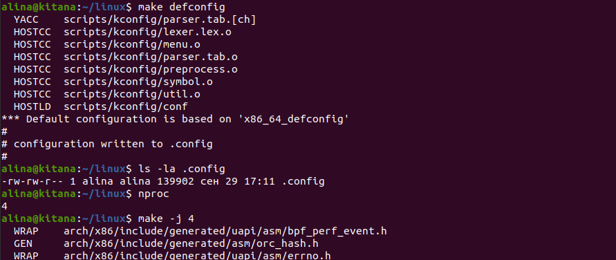
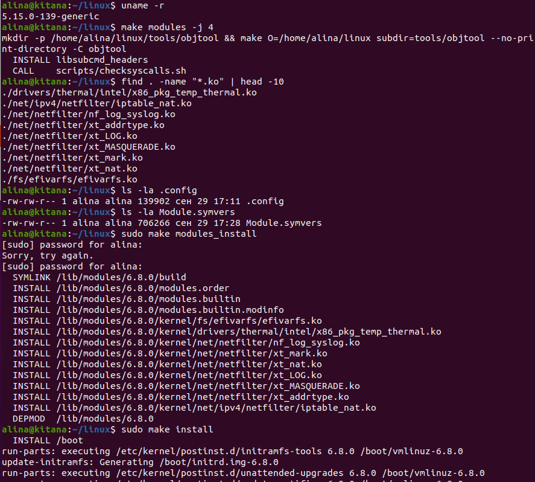
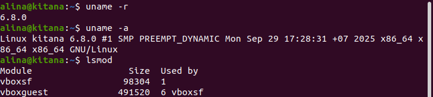
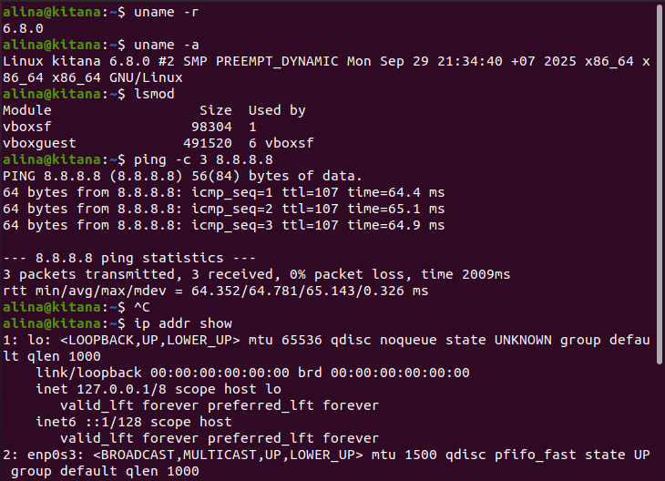
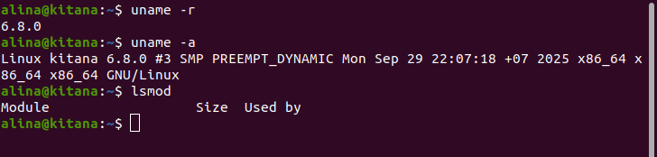
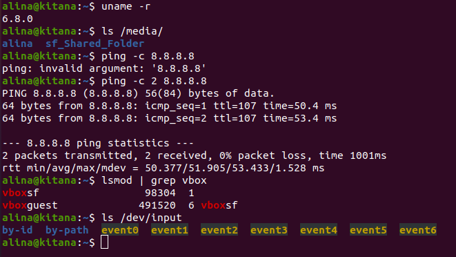
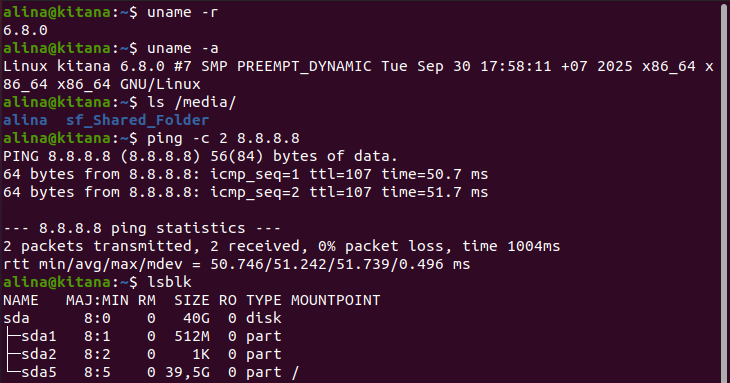
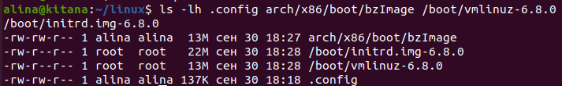
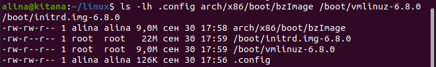

# Сборка ядра Linux для x86_64

**Цель**: Собрать ядро Linux для x86_64, постараться выключить все лишние опции. Установить и проверить работоспособность.

**Исходное ядро**: 5.15.0-139-generic  
**Целевое ядро**: 6.8.0  
**Платформа**: Ubuntu 20.04 в VirtualBox

## Подготовка окружения

```bash
# Установка инструментов сборки
sudo apt update
sudo apt install libssl-dev flex bison libelf-dev

# Клонирование репозитория ядра
git clone git://git.kernel.org/pub/scm/linux/kernel/git/torvalds/linux.git
cd linux
git checkout v6.8
```



## Конфигурация и сборка

```bash
# Базовая конфигурация для x86_64
make defconfig

# Сборка ядра
make -j4

# Сборка модулей  
make modules -j4
```

## Установка

```bash
# Установка модулей
sudo make modules_install

# Установка ядра и обновление GRUB
sudo make install

# Перезагрузка
sudo reboot
```



## Проверка работоспособности

```bash
# Проверка версии ядра
uname -r
uname -a

# Проверка загруженных модулей
lsmod
```



## Оптимизация конфигурации 1

### Отключенные опции:
- **Sound card support** - звуковые драйверы (в VM не требуются)
- **AGP Support** - устаревшая шина для видеокарт
- **Intel HD Graphics** - драйверы для физических GPU Intel
- **USB Network Adapters** - USB-сетевые адаптеры
- **Wireless LAN** - Wi-Fi драйверы  
- **Network console logging** - сетевое логирование

### Проверка работоспособности после оптимизации:

```bash
# Сборка оптимизированного ядра
make -j4
make modules -j4
sudo make modules_install
sudo make install
sudo reboot
```
## Результат:

- Ядро успешно загрузилось (версия 6.8.0 #2)
- Сетевое соединение работает: ping 8.8.8.8 - успешно
- Графический интерфейс функционирует
- Базовые системные утилиты работают корректно



## Оптимизация конфигурации 2

### Отключенные опции:
- **DOS/FAT filesystems** - поддержка Windows файловых систем
- **HugeTLB support** - поддержка огромных страниц памяти
- **Network File Systems** - сетевые файловые системы (NFS)
- **FUSE support** - файловые системы в пользовательском пространстве

### Результат:
- Ядро успешно загрузилось (версия 6.8.0 #3)
- Система стабильно работает
- VirtualBox Guest Additions требуют доработки конфигурации



## Оптимизация конфигурации 3

### Отключенные опции:
- **USB Printer support** - поддержка USB-принтеров
- **Wireless** - драйверы Wi-Fi (не нужны в VM)  
- **Plan 9 Resource Sharing Support** - экзотическая сетевая ФС

### Включенные обратно:
- **HugeTLB support** - поддержка огромных страниц памяти (требуется для VirtualBox Shared Folders)

### Результат:
- Ядро успешно загрузилось (версия 6.8.0 #6)
- Общие папки VirtualBox работают корректно
- Сетевое соединение функционирует
- Устройства ввода работают стабильно



## Оптимизация конфигурации 4

### Отключенные опции:
- **SCSI CDROM support** - поддержка SCSI CD-ROM
- **RAID support** - поддержка RAID-массивов  
- **MD bitmap, Mirror, Zero targets** - компоненты RAID/LVM
- **AMD IOMMU support** - поддержка AMD IOMMU
- **Intel IOMMU performance events** - события производительности IOMMU
- **PCCard support** - поддержка PCMCIA карт
- **IP multicast routing** - multicast маршрутизация
- **RARP support** - устаревший протокол обратного ARP
- **BOOTP support** - устаревший протокол загрузки

### Результат:
- Ядро успешно загрузилось (версия 6.8.0 #7)
- Все критичные функции сохранились (сеть, shared folders, диски)
- Система работает стабильно
- Размер ядра существенно уменьшен



## Сравнение размеров до и после оптимизации

### Размеры defconfig (базовое ядро):
- Конфигурация: 137 KB
- Скомпилированное ядро: 13 MB 

### Размеры оптимизированного ядра (#7):
- Конфигурация: 126 KB  
- Скомпилированное ядро: 9.0 MB

### Результат оптимизации:
- **Ядро уменьшено на: 4 MB (31%)**
- **Конфигурация упрощена на: 11 KB (8%)**




## Вывод
В результате выполнения задания было успешно собрано и установлено ядро Linux версии 6.8.0 для архитектуры x86_64. В процессе оптимизации конфигурации удалось отключить множество неиспользуемых в виртуальной машине компонентов, что привело к уменьшению размера ядра на 31% (с 13 MB до 9 MB) при сохранении всей необходимой функциональности.
