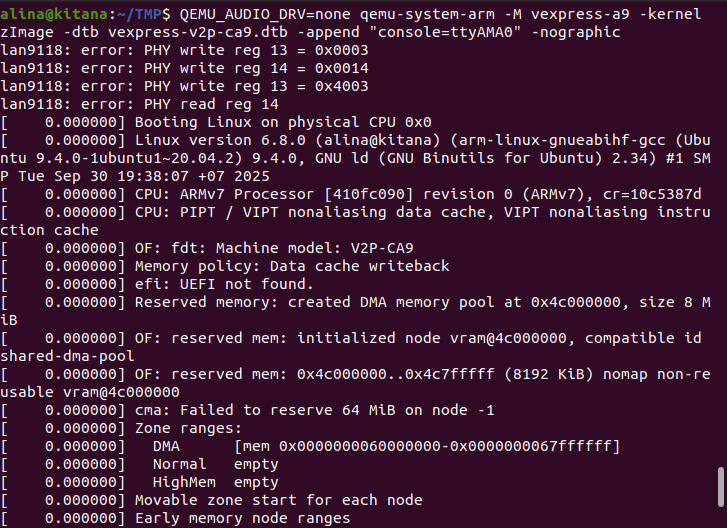
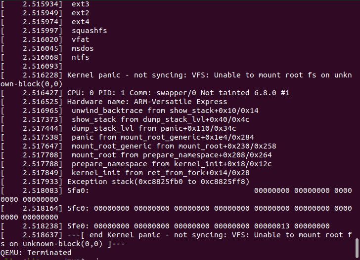

# Сборка ядра Linux для ARM и запуск в QEMU

**Цель**: Собрать ядро Linux для архитектуры ARM, запустить в QEMU и проверить работоспособность.

## Подготовка окружения

```bash
# Установка кросс-компилятора для ARM
sudo apt-get install gcc-arm-linux-gnueabihf gcc-10-arm-linux-gnueabihf

# Установка QEMU для ARM
sudo apt-get install qemu-system-arm
```

## Конфигурация ядра для ARM

```bash
# Переходим в директорию с исходниками ядра
cd ~/linux

# Очищаем предыдущие сборки
make mrproper

# Конфигурируем для ARM 
ARCH=arm make defconfig
```

## Сборка ядра

```bash
# Сборка ядра с кросс-компиляцией
ARCH=arm CROSS_COMPILE=arm-linux-gnueabihf- make -j4 zImage

# Сборка Device Tree
ARCH=arm make -j4 dtbs
```

## Подготовка файлов для QEMU

```bash
# Создаем временную директорию для файлов
mkdir ~/TMP

# Копируем собранное ядро
cp linux/arch/arm/boot/zImage ~/TMP/

# Копируем device tree для vexpress-a9
cp linux/arch/arm/boot/dts/arm/vexpress-v2p-ca9.dtb ~/TMP/
```

## Запуск в QEMU

```bash
# Переходим в директорию с файлами
cd ~/TMP

# Запускаем QEMU с собранным ядром
QEMU_AUDIO_DRV=none qemu-system-arm -M vexpress-a9 -kernel zImage \
  -dtb vexpress-v2p-ca9.dtb -append "console=ttyAMA0" -nographic
```

## Проверка работоспособности



