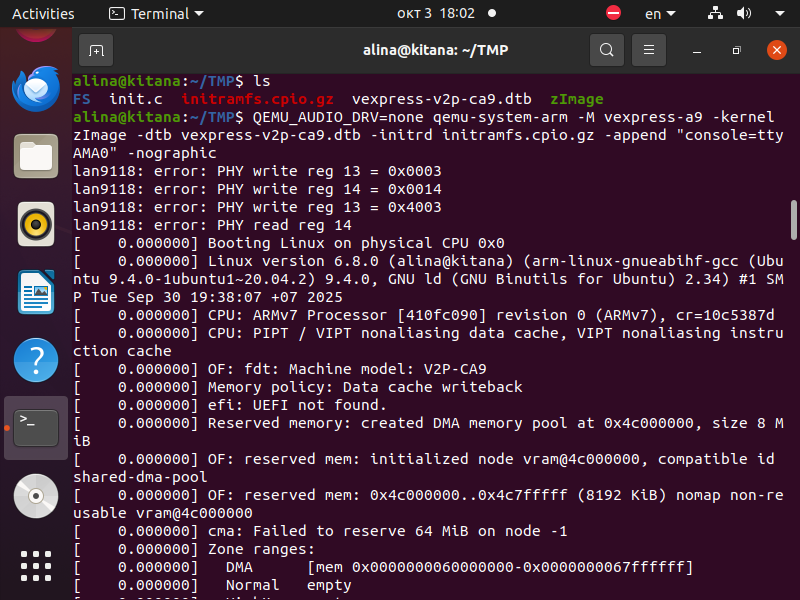
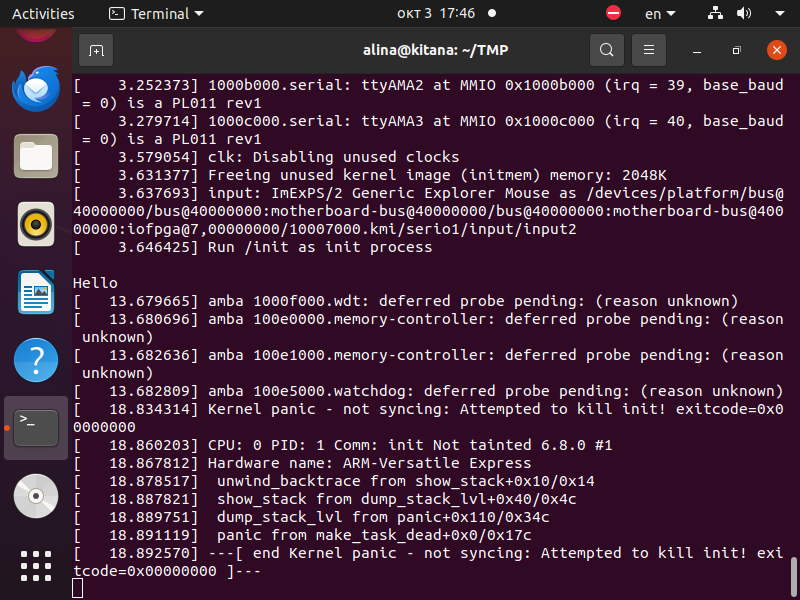

# Создание минимальной корневой файловой системы для ARM

**Цель**: Собрать корневую файловую систему состоящую из одного процесса init, который выводит строку "Hello" и засыпает на 15 секунд. Проверить работоспособность в QEMU.

## Создание init процесса

```c
#include <stdio.h>
#include <unistd.h>

int main(void){
    printf("\nHello\n");
    sleep(15);
    return 0;
}
```

## Компиляция init процесса

```bash
# Компилируем статически
arm-linux-gnueabihf-gcc -static init.c -o init
```

## Подготовка файловой системы

```bash
# Создаем директорию для ФС
mkdir FS

# Копируем init в ФС
mv init FS/

# Создаем initramfs архив
cd FS
echo init | cpio -o -H newc | gzip > initramfs.cpio.gz
```

## Запуск в QEMU с корневой ФС

```bash
# Запускаем QEMU с initramfs
QEMU_AUDIO_DRV=none qemu-system-arm -M vexpress-a9 -kernel zImage \
  -dtb vexpress-v2p-ca9.dtb -initrd initramfs.cpio.gz \
  -append "console=ttyAMA0" -nographic
```

## Проверка работоспособности



