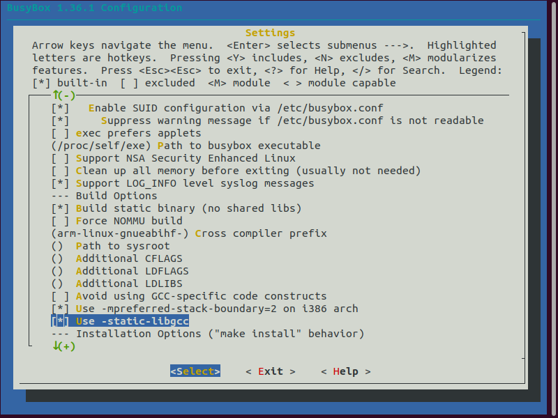
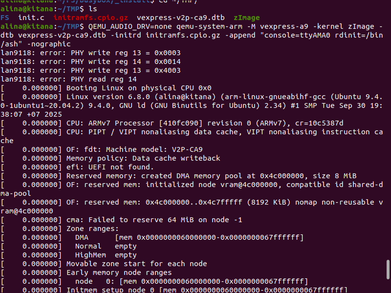
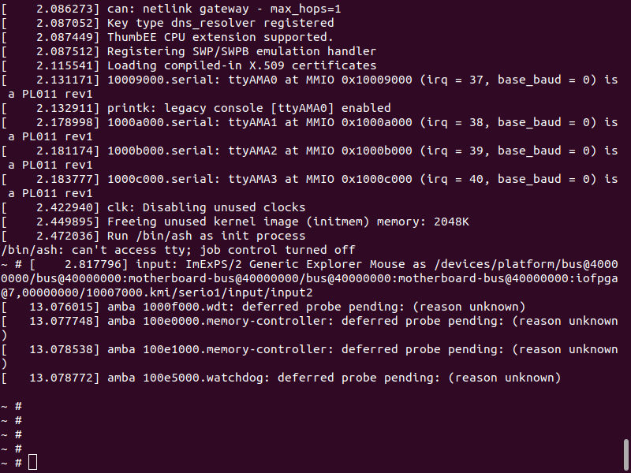
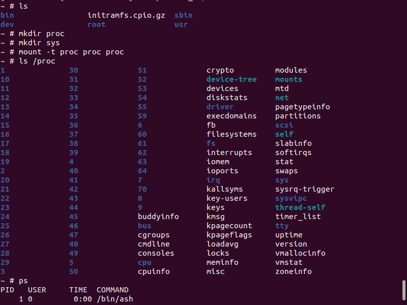

# Создание корневой файловой системы на основе BusyBox

**Цель**: Собрать корневую файловую систему на основе busybox и запустить в QEMU с init процессом в виде командного интерпретатора `/bin/ash`.

## Подготовка окружения

```bash
# Создаем рабочую директорию
mkdir ~/FS
cd ~/FS

# Клонируем исходный код BusyBox
git clone https://git.busybox.net/busybox/
cd busybox

# Переключаемся на стабильную версию 1.36.1
git checkout 1_36_1
```

## Конфигурация BusyBox

```bash
# Очищаем предыдущие конфигурации
make mrproper

# Базовая конфигурация для ARM
ARCH=arm make defconfig

# Настройка конфигурации
ARCH=arm make menuconfig
```

## Ключевые настройки в menuconfig:
- **Settings → Build static binary** - включено
- **Settings → Cross compiler prefix** - `arm-linux-gnueabihf-`



## Сборка и установка BusyBox

```bash
# Сборка BusyBox
ARCH=arm make -j4

# Установка в директорию _install
ARCH=arm make install
```

## Подготовка корневой файловой системы

```bash
# Переходим в директорию установки
cd _install

# Удаляем лишний linuxrc
rm linuxrc

# Создаем initramfs архив
find . | cpio -o -H newc | gzip > initramfs.cpio.gz

# Копируем архив для использования с QEMU
cp initramfs.cpio.gz ~/TMP/
```

## Запуск в QEMU

```bash
# Запускаем QEMU с BusyBox initramfs
cd ~/TMP
QEMU_AUDIO_DRV=none qemu-system-arm -M vexpress-a9 -kernel zImage \
  -dtb vexpress-v2p-ca9.dtb -initrd initramfs.cpio.gz \
  -append "console=ttyAMA0 rdinit=/bin/ash" -nographic
```

## Проверка работоспособности




