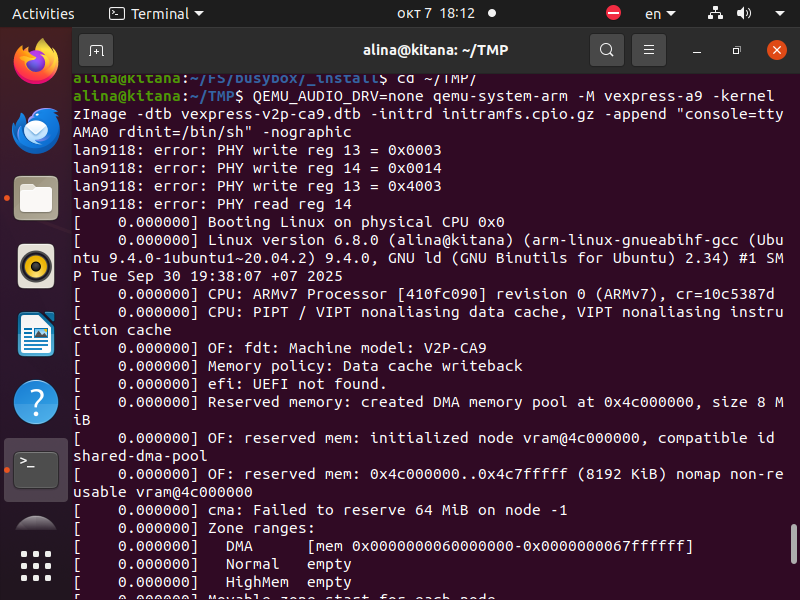
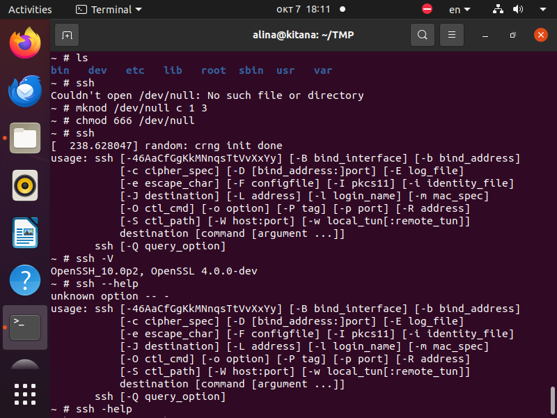

# Сборка OpenSSH для архитектуры ARM

**Цель**: Собрать пакет openssh и все библиотеки от которых он зависит под архитектуру arm. Собранный пакет добавить в корневую файловую систему на основе busybox, запустить в qemu и проверить работоспособность.

## Подготовка исходных кодов

```bash
cd ~/FS

# Клонирование исходных кодов
git clone https://github.com/madler/zlib.git
git clone https://github.com/openssl/openssl.git
git clone https://github.com/openssh/openssh-portable.git
```

## Сборка zlib для ARM

```bash
cd ~/FS/zlib

# Конфигурация и сборка для ARM
CC=arm-linux-gnueabihf-gcc ./configure --prefix=$HOME/FS/zlib/_install
CC=arm-linux-gnueabihf-gcc make
CC=arm-linux-gnueabihf-gcc make install
```

## Сборка OpenSSL для ARM

```bash
cd ~/FS/openssl

# Конфигурация для ARM
./Configure linux-armv4 \
  --prefix=$PWD/_install \
  --cross-compile-prefix=arm-linux-gnueabihf-

# Сборка и установка
make
make install
```

## Сборка OpenSSH для ARM

```bash
cd ~/FS/openssh-portable

# Генерация configure скрипта
autoreconf -fvi

# Конфигурация с указанием путей к зависимостям
./configure --prefix=$PWD/_install \
  --host=arm-linux-gnueabihf \
  --with-zlib=$PWD/zlib \
  --with-ssl-dir=$PWD/openssl \
  --with-privsep-path=$PWD/_install/var/empty \
  CC=arm-linux-gnueabihf-gcc

# Сборка и установка
make
make install-nokeys STRIP_OPT=
```

## Интеграция в корневую файловую систему BusyBox

```bash
# Переход в корневую ФС busybox
cd ~/FS/busybox/_install

# Копирование бинарников OpenSSH
cp ~/FS/openssh-portable/_install/bin/ssh usr/bin/

# Создание директории для библиотек
mkdir -p lib

# Копирование библиотек зависимостей
cp ~/FS/openssl/_install/lib/libcrypto.so.4 lib/
cp ~/FS/openssl/_install/lib/libssl.so.4 lib/
cp ~/FS/zlib/_install/lib/libz.so.1 lib/

# Копирование системных библиотек ARM
cp /usr/arm-linux-gnueabihf/lib/ld-2.31.so lib/
cp /usr/arm-linux-gnueabihf/lib/libc.so.6 lib/
cp /usr/arm-linux-gnueabihf/lib/libresolv.so.2 lib/
cp /usr/arm-linux-gnueabihf/lib/libutil.so.1 lib/
cp /usr/arm-linux-gnueabihf/lib/libdl.so.2 lib/
cp /usr/arm-linux-gnueabihf/lib/libpthread.so.0 lib/

# Копирование библиотек NSS
cp /usr/arm-linux-gnueabihf/lib/libnss_files.so.2 lib/
cp /usr/arm-linux-gnueabihf/lib/libnss_dns.so.2 lib/

# Создание символической ссылки на динамический загрузчик
ln -sf ld-2.31.so lib/ld-linux-armhf.so.3

# Создание необходимых директорий
mkdir -p var/run
mkdir -p etc/ssh

# Создание файлов пользователей
echo "root::0:0:root:/root:/bin/sh" > etc/passwd
echo "root::0:" > etc/group

## Сборка и запуск в QEMU

```bash
# Создание initramfs
find . | cpio -o -H newc | gzip > ~/TMP/initramfs.cpio.gz

# Запуск QEMU
cd ~/TMP
QEMU_AUDIO_DRV=none qemu-system-arm \
  -M vexpress-a9 \
  -kernel zImage \
  -dtb vexpress-v2p-ca9.dtb \
  -initrd initramfs.cpio.gz \
  -append "console=ttyAMA0 rdinit=/bin/sh" \
  -nographic
```

## Проверка работоспособности

После загрузки системы в QEMU:

```bash
# Создание /dev/null
mknod /dev/null c 1 3
chmod 666 /dev/null

# Проверка версии OpenSSH
ssh -V

# Проверка справки
ssh
```

## Проверка работоспособности



