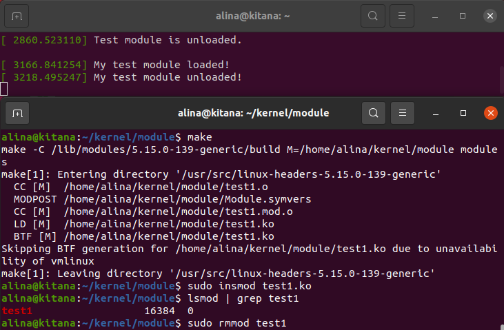
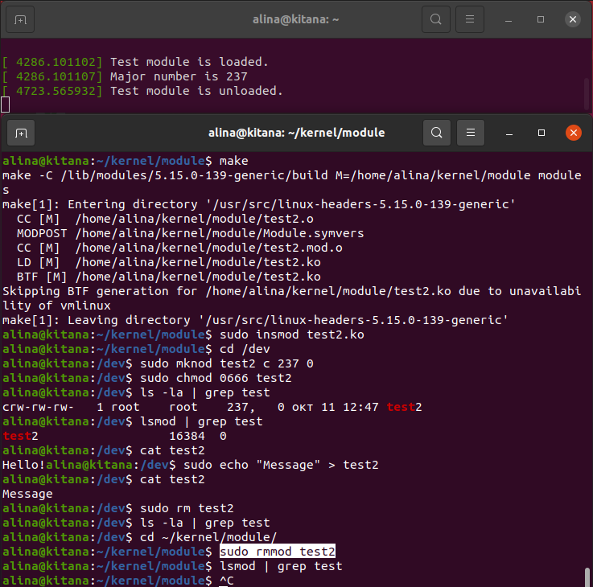
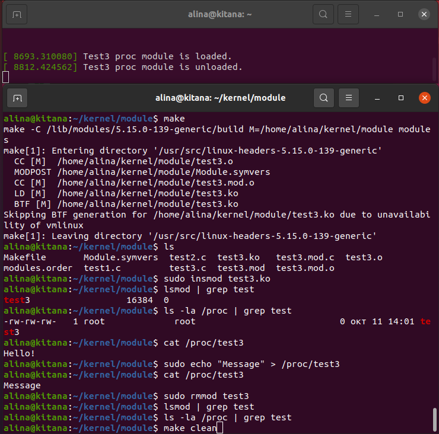
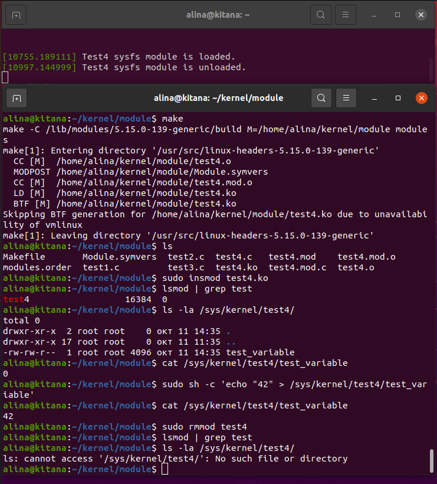

# Написание модулей ядра Linux

**Цель**: Написать модули ядра, которые взаимодействуют с системой через файлы устройств (`/dev`), файловую систему `/proc` и файловую систему `/sys`.

## Подготовка окружения для разработки

```bash
# Создание рабочей директории
mkdir module
cd module
```

## Модуль 1: Базовый тестовый модуль (test1)

### Создание исходного кода

**test1.c**:
```c
#include <linux/module.h>
#include <linux/kernel.h>

int init_module(void){
	pr_info("My test module loaded!");
	return 0;
}

void cleanup_module(void){
	pr_info("My test module unloaded!");
}

MODULE_LICENSE("GPL");
```

### Создание Makefile

**Makefile**:
```makefile
obj-m += test1.o

all:
    make -C /lib/modules/$(shell uname -r)/build M=$(PWD) modules

clean:
    make -C /lib/modules/$(shell uname -r)/build M=$(PWD) clean
```

### Сборка и тестирование модуля

```bash
# В одной консоли смотрим логи
sudo dmesg -w

# В другой консоли сборка модуля
make

# Загрузка модуля
sudo insmod test1.ko

# Проверка загрузки
lsmod | grep test1

# Выгрузка модуля
sudo rmmod test1
```



## Модуль 2: Драйвер символьного устройства (/dev/test2)

### Создание исходного кода

**test2.c**:
```c
#include <linux/module.h>
#include <linux/kernel.h>
#include <linux/fs.h>
#include <linux/rwlock.h>
#include <linux/uaccess.h>

static int major = 0;
static rwlock_t lock;
static char test_string[15] = "Hello!\0";

ssize_t test_read(struct file *fd, char __user *buff, size_t size, loff_t *off){
	size_t rc;

	read_lock(&lock);
	rc = simple_read_from_buffer(buff, size, off, test_string, 15);
	read_unlock(&lock);

	return rc;
}

ssize_t test_write(struct file *fd, const char __user *buff, size_t size,
		loff_t *off)
{
	size_t rc = 0;
	if (size > 15)
		return -EINVAL;

	write_lock(&lock);
	rc = simple_write_to_buffer(test_string, 15, off, buff, size);
	write_unlock(&lock);

	return rc;
}

static struct file_operations fops = {
	.owner = THIS_MODULE,
	.read = test_read,
	.write = test_write
};

int init_module(void)
{
	pr_info("Test module is loaded.\n");
	rwlock_init(&lock);
	major = register_chrdev(major, "test2", &fops);

	if (major < 0)
		return major;
	pr_info("Major number is %d\n", major);

	return 0;
}

void cleanup_module(void)
{
	pr_info("Test module is unloaded.\n");
	unregister_chrdev(major, "test2");
}

MODULE_LICENSE("GPL");
```

### Обновление Makefile

```makefile
obj-m += test2.o

all:
    make -C /lib/modules/$(shell uname -r)/build M=$(PWD) modules

clean:
    make -C /lib/modules/$(shell uname -r)/build M=$(PWD) clean
```

### Сборка и тестирование драйвера устройства

```bash
# Сборка модуля
make clean
make

# Загрузка модуля
sudo insmod test2.ko

# Переходим к файлам устройств
cd /dev

# Создание файла устройства (используя полученный major number)
sudo mknod /dev/test2 c 237 0

# Настройка прав доступа
sudo chmod 0666 /dev/test2

# Проверка загрузки модуля и создания файла 
lsmod | grep test
ls -la | grep test

# Тестирование чтения
cat test2

# Тестирование записи
sudo echo "Message" > test2

# Проверка изменений
cat test2

# Выгрузка модуля
sudo rm test2
cd ~/kernel/module/
sudo rmmod test2
```



## Модуль 3: Взаимодействие через файловую систему /proc

### Создание исходного кода

**test3.c**:
```c
#include <linux/module.h>
#include <linux/kernel.h>
#include <linux/proc_fs.h>
#include <linux/uaccess.h>
#include <linux/string.h>

static struct proc_dir_entry *our_proc_file;
static char test_string[15] = "Hello!\n";

ssize_t procfile_read(struct file *fd, char __user *buff, size_t size, 
		loff_t *off)
{
    ssize_t rc = 0;
    size_t len = strlen(test_string);

    if (*off >= len)
        return 0;

    if (size > len - *off)
        size = len - *off;

    if (copy_to_user(buff, test_string + *off, size))
        return -EFAULT;

    *off += size;
    rc = size;
    return rc;
}

ssize_t procfile_write(struct file *fd, const char __user *buff, size_t size, loff_t *off)
{
    ssize_t rc = 0;

    if (size >= sizeof(test_string))
        return -EINVAL;

    if (copy_from_user(test_string, buff, size))
        return -EFAULT;

    test_string[size] = '\0';
    rc = size;
    return rc;
}

static const struct proc_ops proc_file_ops = {
    .proc_read = procfile_read,
    .proc_write = procfile_write,
};

int init_module(void)
{
    pr_info("Test3 proc module is loaded.\n");

    our_proc_file = proc_create("test3", 0666, NULL, &proc_file_ops);

    if (our_proc_file == NULL) {
        pr_info("Error: Could not create /proc/test3\n");
        return -ENOMEM;
    }

    return 0;
}

void cleanup_module(void)
{
    proc_remove(our_proc_file);
    pr_info("Test3 proc module is unloaded.\n");
}

MODULE_LICENSE("GPL");
```

### Обновление Makefile

```makefile
obj-m += test3.o

all:
    make -C /lib/modules/$(shell uname -r)/build M=$(PWD) modules

clean:
    make -C /lib/modules/$(shell uname -r)/build M=$(PWD) clean
```

### Сборка и тестирование модуля

```bash
# Сборка модуля
make

# Загрузка модуля
sudo insmod test3.ko

# Проверка загрузки модуля и создания файла в /proc
lsmod | grep test
ls -la /proc | grep test

# Тестирование чтения
cat /proc/test3

# Тестирование записи
sudo echo "Message" > /proc/test3

# Проверка изменений
cat /proc/test3

# Выгрузка модуля
sudo rmmod test3
```


## Модуль 4: Взаимодействие через файловую систему /sys

### Создание исходного кода

**test4.c**:
```c
#include <linux/module.h>
#include <linux/kernel.h>
#include <linux/kobject.h>
#include <linux/sysfs.h>
#include <linux/string.h>

static struct kobject *test_kobj;
static int test_variable = 0;

static ssize_t test_variable_show(struct kobject *kobj, 
                                  struct kobj_attribute *attr, 
                                  char *buf)
{
    return sprintf(buf, "%d\n", test_variable);
}

static ssize_t test_variable_store(struct kobject *kobj, 
                                   struct kobj_attribute *attr, 
                                   const char *buf, size_t count)
{
    int ret;
    
    ret = kstrtoint(buf, 10, &test_variable);
    if (ret < 0)
        return ret;
    
    return count;
}

static struct kobj_attribute test_variable_attribute = 
    __ATTR(test_variable, 0664, test_variable_show, test_variable_store);

int init_module(void)
{
    int ret = 0;
    
    pr_info("Test4 sysfs module is loaded.\n");
    
    test_kobj = kobject_create_and_add("test4", kernel_kobj);
    if (!test_kobj) {
        pr_info("Error: Could not create kobject\n");
        return -ENOMEM;
    }
    
    ret = sysfs_create_file(test_kobj, &test_variable_attribute.attr);
    if (ret) {
        pr_info("Error: Could not create sysfs file\n");
        kobject_put(test_kobj);
        return ret;
    }
    
    return 0;
}

void cleanup_module(void)
{
    kobject_put(test_kobj);
    pr_info("Test4 sysfs module is unloaded.\n");
}

MODULE_LICENSE("GPL");
```

### Обновление Makefile

```makefile
obj-m += test4.o

all:
    make -C /lib/modules/$(shell uname -r)/build M=$(PWD) modules

clean:
    make -C /lib/modules/$(shell uname -r)/build M=$(PWD) clean
```

### Сборка и тестирование модуля

```bash
# Сборка модуля
make

# Загрузка модуля
sudo insmod test4.ko

# Проверка загрузки модуля и создания директории в /sys
lsmod | grep test
ls -la /sys/kernel/test4/

# Тестирование чтения
cat /sys/kernel/test4/test_variable

# Тестирование записи
sudo sh -c 'echo "42" > /sys/kernel/test4/test_variable'

# Проверка изменений
cat /sys/kernel/test4/test_variable

# Выгрузка модуля
sudo rmmod test4
```


